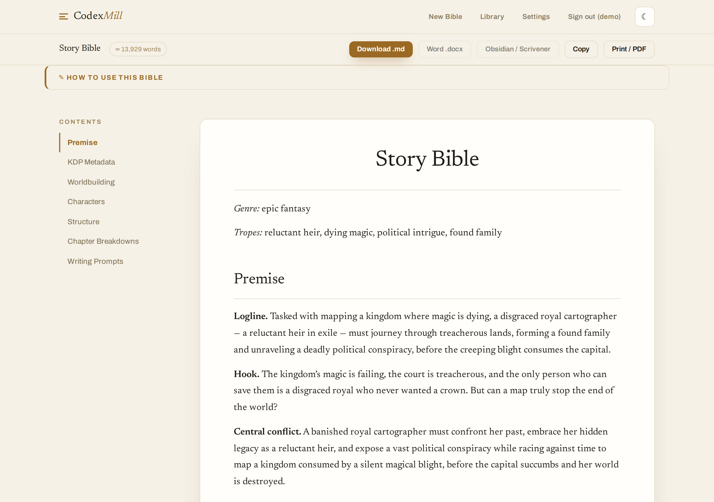
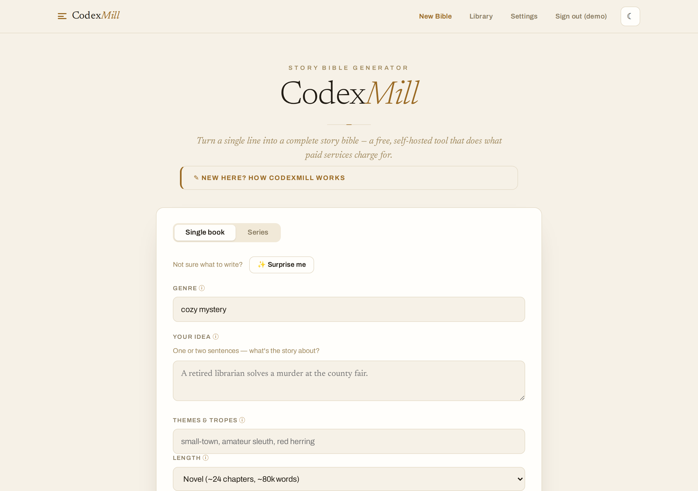
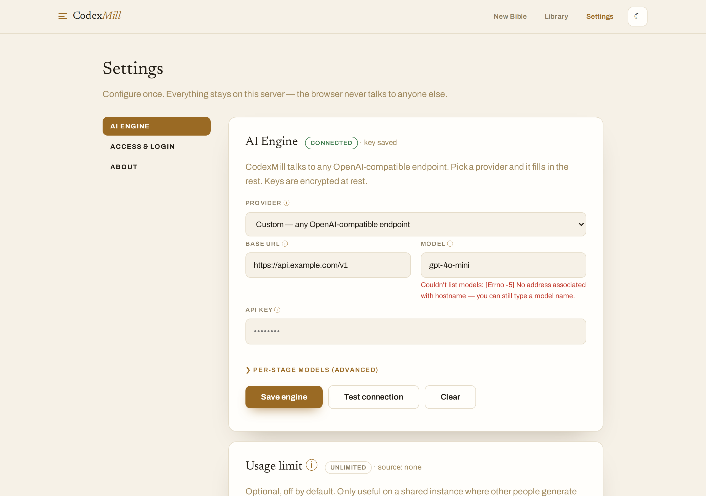

<p align="center">
  <picture>
    <source media="(prefers-color-scheme: dark)" srcset="docs/images/logo-dark.png">
    
  </picture>
</p>

> ## 🤖 Built with AI
> **Almost entirely written by AI (Claude).** I'm putting this at the very top, not buried in a
> footnote, because you deserve to know how it was made before you decide whether to trust it or use
> it. It's free and open under **AGPL-3.0**: read every line, fork it, run it, break it.

## The "Why?"

One of my co-workers found some site selling these story bibles for absurd prices. They were almost
certainly written by AI. It seemed absurd somebody would charge $100 for something that only took 5
minutes and some basic prompting to produce. I may at some point decide to host this as SaaS, but the
self-hosting option will always be available and free.

---

A one-line premise becomes a full **story bible**: premise, world, characters with distinct voices, a
beat-driven structure, chapter breakdowns, a ready-to-paste writing prompt per chapter, and KDP
metadata. Point it at any OpenAI-compatible LLM, a cloud key or a local Ollama.

## See it



| New bible | Settings |
|---|---|
|  |  |

📄 **[Browse a full example bible](examples/sample-story-bible.md)** — a complete 7-section
epic-fantasy codex, generated by CodexMill.

## How it works

Seven stages, each feeding the next:

1. **premise** — genre + tropes → a logline.
2. **worldbuilding** — history, geography, cultures, factions, and the world's rules.
3. **characters** — protagonist / antagonist / supporting, each with motivation, flaw, arc, and a
   *voice sheet* so they don't blur together.
4. **structure** — a story-beat framework (three-act, romance beats) mapped onto chapters.
5. **chapter breakdowns** — scenes and beats per chapter, with a rolling summary for consistency.
6. **writing prompts** — one ready-to-paste prompt per chapter.
7. **KDP metadata** — keywords, categories, a publish-ready blurb.

The output is one Markdown bundle you read in the browser, export (Word / Obsidian / PDF), or paste
into any writing tool.

## Install & run

### Quick start
```bash
docker run -d \
  --name codexmill \
  -p 8000:8000 \
  -v codexmill-data:/data \
  --add-host host.docker.internal:host-gateway \
  ghcr.io/functional-slop/codexmill:latest
```
Open **http://localhost:8000**, create your admin account, and set your AI engine in **Settings**.
The image is multi-arch (amd64 + arm64), runs as a non-root user, and ships with no model.

### docker compose
```yaml
services:
  codexmill:
    image: ghcr.io/functional-slop/codexmill:latest
    ports:
      - "8000:8000"
    volumes:
      - codexmill-data:/data
    extra_hosts:
      - "host.docker.internal:host-gateway"
    restart: unless-stopped
volumes:
  codexmill-data:
```
`docker compose up -d`, then open http://localhost:8000.

### Ports, volumes, and flags
| Flag | What it does |
|---|---|
| `-p 8000:8000` | Web UI, `host:container`. Change the left number to use a different host port. |
| `-v codexmill-data:/data` | Persists config and saved bibles across restarts and updates. |
| `--add-host host.docker.internal:host-gateway` | Lets the container reach a local Ollama on the host (Linux; Docker Desktop adds this automatically). |

### Update
```bash
docker pull ghcr.io/functional-slop/codexmill:latest
docker rm -f codexmill
# re-run the same `docker run` command above
```
Your data is safe in the `codexmill-data` volume. Tags: `latest`, and pinned versions like `v0.1.0`.

### Configuration
Everything is optional, most of it is easier to set in **Settings**. To wire up an engine at startup
instead, pass environment variables:

| Variable | Default | Purpose |
|---|---|---|
| `CODEXMILL_BASE_URL` | set in UI | OpenAI-compatible endpoint, e.g. `http://host.docker.internal:11434/v1` for a host Ollama. |
| `CODEXMILL_MODEL` | set in UI | Model name, e.g. `llama3.2`. |
| `CODEXMILL_API_KEY` | set in UI | API key (`ollama` for a local Ollama). |
| `CODEXMILL_SECRET_KEY` | auto-generated | Encrypts stored keys/secrets at rest (`openssl rand -hex 32`). Preserve it across updates. |
| `CODEXMILL_SOURCE_URL` | this repo | AGPL: if you modify and serve CodexMill, point this at your source. |
| `CODEXMILL_OIDC_ISSUER` / `_CLIENT_ID` / `_CLIENT_SECRET` | off | Optional SSO for a shared instance (or configure in Settings). |

Full list in [`.env.example`](.env.example). No model yet? The UI's **"See a sample"** shows a full
pre-generated bible.

### Run from source (no Docker)
```bash
uv run codexmill serve                                              # web UI at http://127.0.0.1:8000
uv run codexmill generate --spec examples/minimal.yaml --out out/   # CLI
```

## Develop

```bash
uv sync              # install deps + dev group into .venv
pre-commit install   # ruff + mypy (strict) + the offline test suite gate every commit
```
